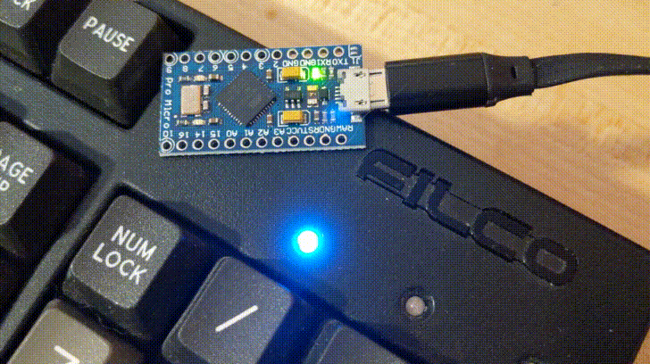

# NeverNotNumlock

If you have a 101/104/etc-key keyboard it should probably be a 100/103/etc-key keyboard because the Num Lock key serves zero purpose other than to annoy me when for some reason isn't enabled and I want to type a number like a normal person but no instead I now have an extra set of cursor keys IMMEDIATELY ADJACENT TO MY EXISTING SET OF CURSOR KEYS.

If you have fingers and a keyboard I'm sure you'll agree, Num Lock is great but having a button to turn it off is not great.  It's not great at all.  In fact, it's actively awful.  You know when Num Lock should not be on I ask rhetorically? *NEVER* I answer a little to loudly for the people around me.

## SO WHAT DOES IT DO?

Num Lock turns off, NeverNotNumlock turns Num Lock back on **BECAUSE NUM LOCK SHOULD NEVER BE OFF WHY DID THIS KEY EVER GET INVENTED**

## HOW TO FINALLY PUT AN END TO NUMLOCK'S BULLSHIT

`1.` [Obtain HID-capable board](https://amzn.to/2Gie1Xu) supported by [the awesome Project-HID Library](https://github.com/NicoHood/HID)

`1.` Install [the awesome Project-HID Library](https://github.com/NicoHood/HID) in your favorite Arduino IDE

`1.` [Flash this here code](NeverNotNumlock.ino) to your new buddy the NeverNotNumlock and sleep tight in the confidence that Num Lock will never turn off again.

`2.` **THERE IS NO STEP TWO**

## WARNING THE FOLLOWING MOTION PICTURE MAY CONTAIN GRAPHIC IMAGERY FOR INDIVIDUALS SENSITIVE TO NUM LOCK BEING OFF

